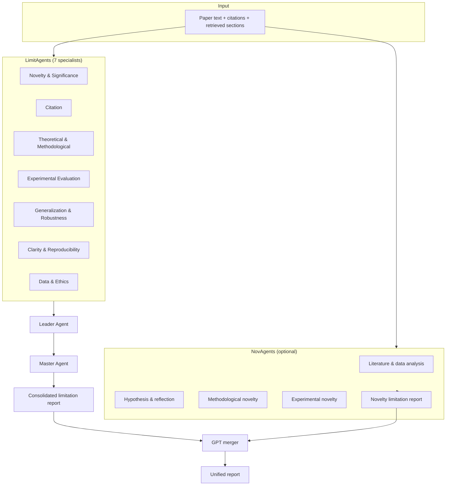

# SciLimAgents

**Multi-agent large language models for scientific limitation analysis.**

SciLimAgents is a research codebase for automatically identifying limitations in scientific papers using coordinated specialist LLM agents. The system mirrors peer-review practice: domain experts critique different aspects of a manuscript, a leader agent orchestrates the discussion, and a master agent produces a consolidated limitation report. A parallel **novelty** track analyzes related literature and produces complementary findings, which can be merged with the limitation track for a unified review.

This repository contains inference pipelines, retrieval modules, ground-truth tooling, preference-learning experiments (SFT / DPO / GRPO), and reimplementations of published baselines. **Source code only** — datasets, model weights, and runtime JSON artifacts are excluded and must be prepared locally (see [Data & artifacts](#data--artifacts)).

---

## Overview

| Component | Description |
|-----------|-------------|
| **LimitAgents** | Seven specialist agents + Leader + Master for comprehensive limitation extraction |
| **NovAgents** | Multi-agent novelty & significance analysis using retrieved related papers |
| **LimitAgents + NovAgents** | GPT-based merger that combines both reports into one consolidated list |
| **Shared memory & RAG** | BM25 / FAISS retrieval over a knowledge corpus and cited-paper context |
| **Ground-truth pipeline** | LLM-assisted extraction, categorization, and novelty validation |
| **Training** | SFT, DPO, and GRPO pipelines for aligning worker / leader / master roles |
| **Baselines** | 12+ comparison methods (zero-shot, multi-agent reviews, RL-style generators) |
| **Evaluation** | Pointwise coverage metrics against human / peer-review ground truth |

---

## Architecture



**LimitAgents specialist roles**

1. **Novelty & Significance** — incremental contributions, impact claims, scope  
2. **Citation** — misuse or omission of cited work  
3. **Theoretical & Methodological** — assumptions, proofs, ablations  
4. **Experimental Evaluation** — baselines, metrics, statistical rigor  
5. **Generalization, Robustness & Efficiency** — OOD behavior, scalability, deployment  
6. **Clarity, Interpretability & Reproducibility** — exposition and replicability  
7. **Data & Ethics** — dataset quality, bias, fairness, societal impact  

The **Leader** routes prompts, requests refinements, and collects specialist outputs. The **Master** deduplicates and synthesizes a final bullet list (typically 10–20 items).

---

## Repository structure

```
sciLimAgents_github/
├── SciLimAgents/                 # Main proposed method
│   ├── LimitAgents/              #   gpt | llama | mistral | qwen
│   ├── NovAgents/                #   novelty-focused multi-agent pipelines
│   ├── LimitAgents+NovAgents/    #   merge limitation + novelty reports
│   └── Ablation/                 #   leave-one-agent-out master synthesis
├── SciLimAgents+DPO/             # Preference learning on agent roles
│   ├── Teacher_model/            #   GPT rollouts → SFT/DPO pair construction
│   ├── LimitAgents+DPO/          #   per-role SFT + DPO (qwen, mistral, llama)
│   └── LimitAgents_DPO+NovAgents/
├── SciLimAgents+GRPO/            # GRPO variant (Qwen)
├── shared_memory_and_rag/        # RAG index build + retrieval + similar-paper join
├── ground_truth_processing/      # GT extraction, categories, novelty checks
├── pointwise_evaluation/         # Coverage / similarity vs. ground truth
├── Data_extraction/              # GROBID & Science Parse PDF → structured text
├── baselines/                    # Comparison methods (see table below)
└── other_experiments/            # SFT, DPO, GRPO, NovAgentsDPO ablations
```

---

## Requirements

### Hardware

- **API-only runs (GPT / Gemini):** modest CPU; network access for API calls  
- **Local models (Llama / Mistral / Qwen):** NVIDIA GPU with sufficient VRAM (7B–70B depending on script; vLLM used in several LimitAgents paths)  

### Software

- Python **3.10+**  
- CUDA-compatible PyTorch (for local inference)  
- Core Python packages (install as needed per script):

```bash
pip install pandas numpy tqdm openai tiktoken
pip install transformers torch accelerate
pip install autogen-agentchat   # GPT multi-agent (LimitAgents/gpt, NovAgents/gpt)
pip install vllm                # local Mistral/Llama LimitAgents
pip install langchain-community langchain-huggingface faiss-cpu  # RAG modules
pip install trl peft bitsandbytes  # SFT / DPO training
```

Individual baseline folders may list additional dependencies (e.g. `baselines/AgentReview/gpt/requirements.txt`).

### API keys (set via environment variables)

```bash
export OPENAI_API_KEY="..."      # GPT-4o / GPT-4o-mini pipelines
export GEMINI_API_KEY="..."      # Gemini ground-truth & eval scripts
export HF_TOKEN="..."            # optional; Hugging Face model download
export HUGGING_FACE_HUB_TOKEN="..."  # alias used in some PBS / training scripts
```

Never commit keys to the repository.

---

## Data & artifacts

Preprocessed paper CSVs are **not** shipped with this release. Place your data under a top-level `data/` directory (paths in scripts are relative to the repo root). Typical columns include:

| Column | Role |
|--------|------|
| `input_text_cleaned` | Main paper body (abstract + sections) |
| `cited_in_text` / `cited_in_ret` | Citation context (text + retrieval) |
| `relevant_papers_list` | Related papers for NovAgents |
| `final_lim_gt_author_peer_cat_maj_hum_cleaned` | Ground-truth limitations (evaluation) |

**Excluded from the repo** (regenerate locally):

- `*.json`, `*.jsonl` — rollouts, SFT/DPO datasets, metrics  
- Model checkpoints (`*.safetensors`, `*.pt`, LoRA adapters)  
- `other_experiments/sft/sft_qwen25_3b_model/`  
- `SciLimAgents+DPO/Teacher_model/sft_and_dpo_pairs/`  

Output directories are created automatically when you run each script.

---

## Quick start

### 1. Clone and configure

```bash
git clone <repository-url>
cd sciLimAgents_github
export OPENAI_API_KEY="your-key"
```

### 2. Prepare data

Place your evaluation CSV at a path referenced by the script you run, e.g.:

```
data/balanced_data/df_updated_with_retrieval.csv
```

Update the `INPUT_CSV` constant at the top of the entry script if your filename differs.

### 3. Run LimitAgents (GPT, multi-agent)

```bash
cd SciLimAgents/LimitAgents/gpt
python limgen.py
```

Uses AutoGen with GPT-4o-mini: seven specialists → Leader → Master. Output path is set via `OUTPUT_SLICE` in the script.

### 4. Run LimitAgents (local Mistral via vLLM)

```bash
cd SciLimAgents/LimitAgents/mistral
python limagents.py
```

Expects Mistral-7B-Instruct weights under `models/mistral_7b_v3_instruct/` (download separately).

### 5. Run NovAgents (GPT, group chat)

```bash
cd SciLimAgents/NovAgents/gpt
python novelty_lim_7_agents.py
```

### 6. Merge limitation + novelty reports

```bash
cd SciLimAgents/LimitAgents+NovAgents/gpt
python merge.py
```

Configure `DF_PATH` to point to your aligned limitation/novelty CSV pair.

### 7. Evaluate against ground truth

```bash
cd pointwise_evaluation
python eval.py
```

Computes coverage-style metrics (Jaccard, semantic overlap) between model outputs and parsed ground-truth limitations.

---

## End-to-end workflow

A typical experimental pipeline:

```
PDFs  →  Data_extraction/          (GROBID / Science Parse)
      →  shared_memory_and_rag/    (build index, retrieve citations & sections)
      →  SciLimAgents/             (LimitAgents ± NovAgents ± merge)
      →  pointwise_evaluation/     (quantitative comparison to GT)
```

For **training aligned agents**:

```
SciLimAgents+DPO/Teacher_model/rollout_gpt.py   →  multi-turn rollouts per role
      →  reward_model.py                        →  score & build preference pairs
      →  LimitAgents+DPO/*/train_*_sft.py       →  role-specific SFT
      →  LimitAgents+DPO/*/train_worker_dpo.py  →  DPO refinement
      →  */inference.py                         →  generate on held-out papers
```

Alternative training paths live under `other_experiments/sft/`, `other_experiments/grpo/`, and `other_experiments/NovAgentsDPO/`.

---

## Baselines

The `baselines/` directory contains standalone reimplementations and adapters for comparison:

| Folder | Method / idea |
|--------|----------------|
| `zero_shot/` | Single-prompt GPT limitation generation |
| `EARCM/` | Multi-agent sequential & parallel (GPT, Mistral, Llama, Qwen) |
| `MAMORX/` | Multi-agent limitation generation (Llama / Mistral / Qwen) |
| `MARG/` | Multi-agent with retrieval-augmented generation |
| `AgentReview/` | Agent-based review pipeline (GPT + open models) |
| `AIScientists/` | AI-scientist-style reviewer |
| `DeepReview/` | Deep multi-stage review |
| `ReviewGrounder/` | Grounded review generation |
| `ReviewRL/` | ReviewRL-style query + generation pipeline |
| `REMOR` | GRPO-style limitation training |
| `DPO/` | Direct preference optimization baseline |
| `GRPO/` | Group relative policy optimization variants |

Each subfolder is self-contained: check the `main.py`, `limgen.py`, or `config.py` entry point and run from that directory.

---

## Ground-truth processing

`ground_truth_processing/` supports building and validating evaluation references:

- **`ground_truth_extraction_by_llm/`** — extract limitations with GPT-4o-mini, Gemini, Llama-3-8B/70B, or Mistral judge  
- **`assign_categories_to_ground_truth/`** — assign limitation categories (majority vote / per-model)  
- **`novelty_ground_truth_eval/`** — novelty-focused GT checks (Gemini, Mistral)  

These scripts write outputs locally; nothing is committed to git (see `.gitignore`).

---

## Shared memory & RAG

| Script | Purpose |
|--------|---------|
| `creating_rag.py` | Build RAG corpus from knowledge-source CSV |
| `retrieval_from_rag.py` | BM25 retrieval of relevant sections per query paper |
| `retrieve_text_bm_faiss_from_cited_in.py` | FAISS + embedding retrieval from cited-in fields |
| `retrieve_paper_level.py` | Paper-level dense retrieval |
| `build_paper_level_index.py` | Index construction for paper-level search |
| `take_similar_papers_from_matching.py` | Join retrieved sections with metadata |

Run RAG build steps before NovAgents or retrieval-augmented baselines that expect enriched CSV columns.

---

## Configuration conventions

- **Paths** — All paths in scripts are **relative to the repository root** (or the script’s working directory). Edit `INPUT_CSV`, `OUTPUT_DIR`, and `CACHE_DIR` constants at the top of each file.  
- **Models** — Open-weight models are expected under `models/<name>/` (e.g. `models/mistral_7b_v3_instruct`, `models/qwen2_5_3b_instruct`).  
- **Checkpoints** — Training scripts save to `output/` or role-specific folders; these are git-ignored.  
- **Reproducibility** — Many scripts expose `--seed`, `--temperature`, and optional `--start` / `--end` row indices via `argparse` (defaults process the full dataset).  

---

## Project statistics

- **~200** Python modules  
- **~3 MB** repository size (code only)  
- **4** backbone families: GPT (API), Llama, Mistral, Qwen  
- **12+** baseline implementations  

---

## Citation

If you use this code in your research, please cite the accompanying paper (details to be added upon de-anonymization).

```bibtex
@article{scilimagents2025,
  title   = {SciLimAgents: Multi-Agent LLMs for Scientific Limitation Analysis},
  author  = {Anonymous},
  journal = {Under review},
  year    = {2025}
}
```

---

## License

This repository is released for research purposes. Add your license file (`LICENSE`) before public release if not already present.

---

## Troubleshooting

| Issue | Suggestion |
|-------|------------|
| `OPENAI_API_KEY environment variable not set` | Export the key before running GPT scripts |
| CUDA OOM on local models | Reduce `max_model_len`, batch size, or use a smaller checkpoint |
| Missing CSV columns | Match column names in script constants or rename your dataframe |
| AutoGen / vLLM import errors | Install the optional dependency group for that script |
| Empty outputs after merge | Check that limitation and novelty CSVs share a common `id` column |

For questions related to anonymous review, please use the conference submission system rather than identifying information in public issues.
